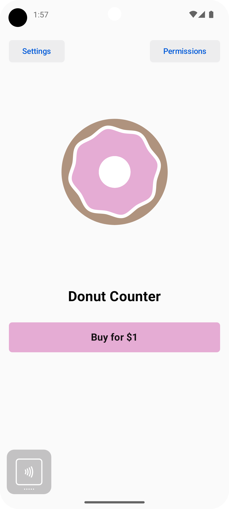
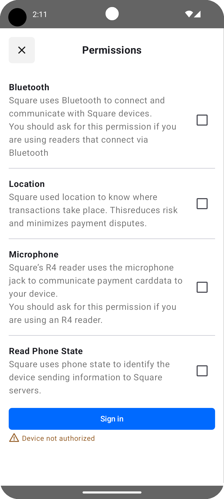
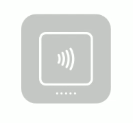
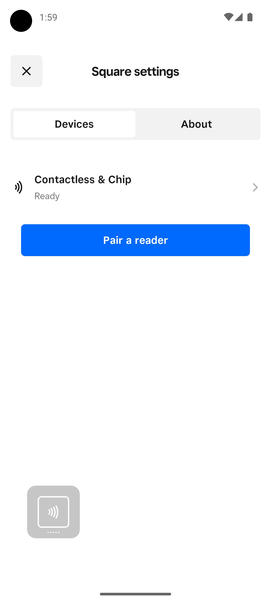
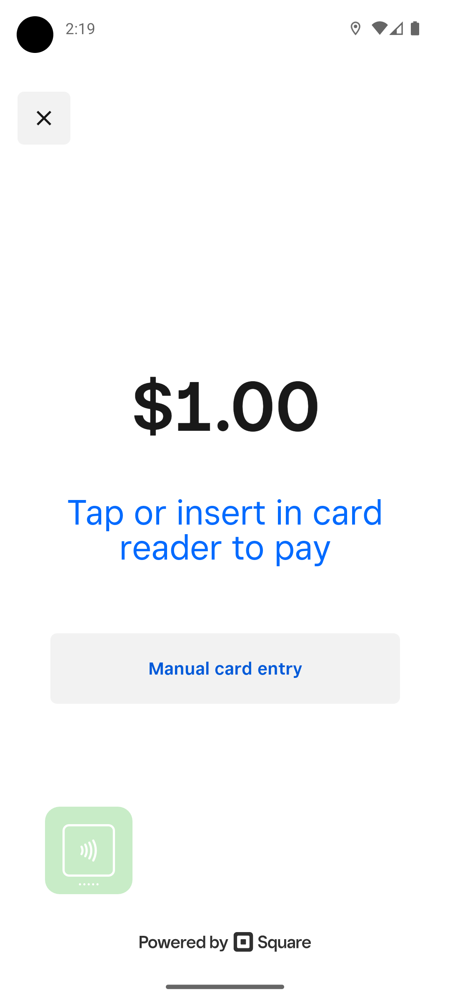

# Mobile Payments SDK Quickstart Sample Android Application

This is a sample application for building with the Square [Mobile Payments SDK](https://developer.squareup.com/docs/mobile-payments-sdk) on Android. It creates a simple application that demonstrates installing, initializing, and authorizing the SDK, as well as taking a $1.00 payment with the Sandbox mock reader. To get started, clone this repo and follow the steps below.

> For more detailed steps on adding the SDK to your application, please see the [longform documentation](https://developer.squareup.com/docs/mobile-payments-sdk/android).



## 1. Review requirements
Before getting started, please review the [Requirements and Limitations](https://developer.squareup.com/docs/mobile-payments-sdk/android#requirements-and-limitations) and [Device Compatibility](https://developer.squareup.com/docs/mobile-payments-sdk/android#device-permissions) sections to ensure that the SDK can be used in your project.

## 2. Get application credentials
In your [Developer Dashboard](https://developer.squareup.com/apps), create an application or open an existing one you would like to use. If this is your first time creating an application with Square, you can review this [Get Started](https://developer.squareup.com/docs/square-get-started) guide for more information.

On the application's Credentials page ensure that the toggle at the top is set to "Sandbox". Make note of:
* **Sandbox Application ID**
* **Sandbox Access Token**

Click "Locations" in the left navigation and make note of the Default Test Account's **Sandbox Location ID** as well. These values will be used in the next step.

## 3. Set credentials
Add the values from Step 2 into `app/src/main/res/values/environments.xml`, replacing `SANDBOX APPLICATION ID`, `SANDBOX ACCESS TOKEN`, and `SANDBOX LOCATION ID` respectively:

```xml
<?xml version="1.0" encoding="utf-8"?>
<resources>
  <string name="mpsdk_application_id">SANDBOX APPLICATION ID</string>
  <string name="mpsdk_access_token">SANDBOX ACCESS TOKEN</string>
  <string name="mpsdk_location_id">SANDBOX LOCATION ID</string>
</resources>
```

In this project, credentials are set in this resource file. In your actual application, you're free to store the values in any way that's secure and makes sense for your project.

## 4. Run the app
At this point the sample project should be runnable. Run it in your preferred Android device or emulator. The remaining steps will walk you through how a user would interact with the app.

Upon opening the app, Mobile Payments SDK will be initialized in `/app/src/main/java/com/example/mpsdkquickstart/DemoApplication.kt`

```kt
class DemoApplication : Application() {
  override fun onCreate() {
    super.onCreate()
    MobilePaymentsSdk.initialize(getString(R.string.mpsdk_application_id), this)
  }
}
```

## 5. Request permissions
In the top right, tap the "Permissions" button. Tap on each of the checkboxes and grant the requested permissions. You can find a breakdown of the requested permissions here: [Device permissions](https://developer.squareup.com/docs/mobile-payments-sdk/android#device-permissions)

In a real application, you'll need to implement this screen yourself.



## 6. Authorize the application
Still within the Permissions dialog, click "Sign in" to authorize the SDK. This creates `MobilePaymentsSdk.authorizationManager()` and calls `authorize()`, which authorizes the SDK using the credentials you set.

For more information on using `AuthorizationManager` see [Authorize your Android Application](https://developer.squareup.com/docs/mobile-payments-sdk/android/configure-authorize).

After authorizing, close the Permissions dialog to return to the main screen.

Note that since you're authorized in Sandbox mode, the floating [Mock Reader UI](https://developer.squareup.com/docs/mobile-payments-sdk/android#4-test-with-mock-readers-in-the-square-sandbox) button is displayed (via `MockReaderUI.show()`).



You can tap on this to simulate adding a Magstripe or Contactless & Chip Reader, as well as simulate swiping/tapping/inserting a card.

## 7. Settings
On the main screen, you can click "Settings" in the top left to display the reader settings screen. This is a preconfigured screen that's included with the SDK, so you *do not* need to implement it yourself. It's displayed by calling `settingsManager.showSettings()`. For more information, see our docs on [Settings Manager](https://developer.squareup.com/docs/mobile-payments-sdk/android/pair-manage-readers#settings-manager).



## 8. Payment
Back on the main scren, tap the "Buy for $1" button. You'll be brought to a checkout screen requesting a $1 payment. Tap the Mock Reader UI button -> Add Contactless & Chip Reader -> Tap Card

After doing so, a test payment will be processed to your Sandbox account. You can verify that it was completed on your [Sandbox Seller Dashboard](https://developer.squareup.com/docs/devtools/sandbox/overview) Transactions page.

